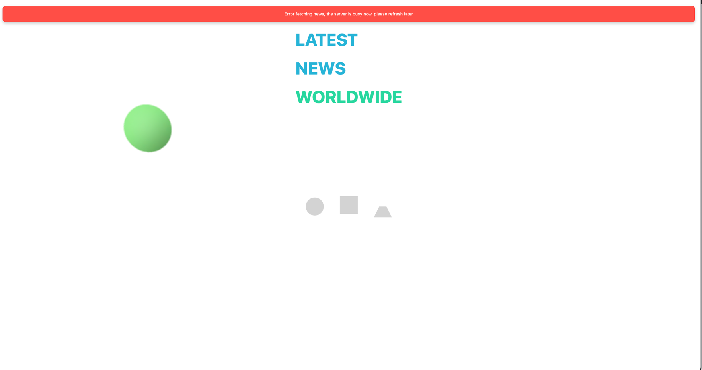

# News Website 

## API Documentation
- **API Provider**: News API
- **API Documentation**: [News API Documentation](https://newsapi.org/docs/endpoints/top-headlines)

## Instructions

### Prerequisites
Before you begin, ensure you have the following installed on your local machine:

- [Node.js](https://nodejs.org/) (version 16.20.2 or higher)
- npm (comes with Node.js)

### Setup

1. **Clone the repository**:
   ```bash
   git clone https://github.com/Reene444/Sample-News.git
   cd Sample-News
   ```

2. **Install dependencies**:
   Install the required libraries and dependencies using npm:
   ```bash
   cd frontend
   npm install --force
   cd ../backend
   npm install
   ```

3. **Additional Libraries**:
    - For frontend (React):
        - [axios](https://www.npmjs.com/package/axios) for making API requests.
          ```bash
          npm install axios
          ```
    - For backend (Node.js):
        - [express](https://www.npmjs.com/package/express) for creating the server.
          ```bash
          npm install express
          ```
        - [apicache](https://www.npmjs.com/package/apicache) for caching API responses.
          ```bash
          npm install apicache
          ```


4. **Run the backend server**:
   Start the backend server:
   ```bash
   npm start
   ```

5. **Run the frontend application**:
   In a new terminal, navigate to the frontend directory (if applicable) and start the React app:
   ```bash
   npm start
   ```
    Go to .env in the fronend folder to change NEWS_API_KEY
6. **Access the application**:
   Open your web browser and navigate to the port specified in your application to view your application.

7. **Demo**:


